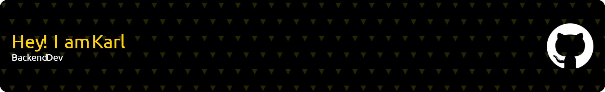

<h3 align="center">15 year old kid that's on a journey to become a software developer</h3>

  

- 🔭 I’m currently working on [IndienMefaGame](https://github.com/Lo10Th/IndienMefaGame)

- 🌱 I’m currently learning **React-Native, Django**

- 👯 I’m looking to collaborate on [Bootstrap-Academy](https://github.com/Bootstrap-Academy/Bootstrap-Academy)

<h3 align="left">Connect with me:</h3>

<h3 align="left">Languages and Tools:</h3>

          

&nbsp;

